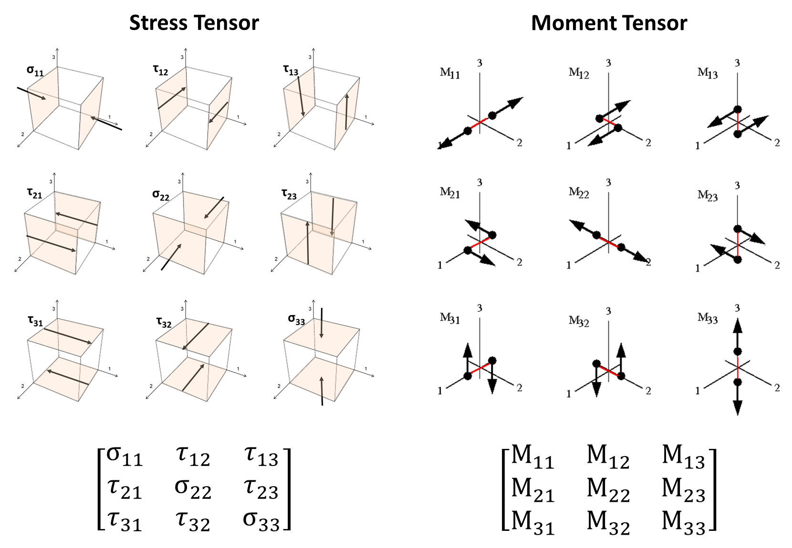
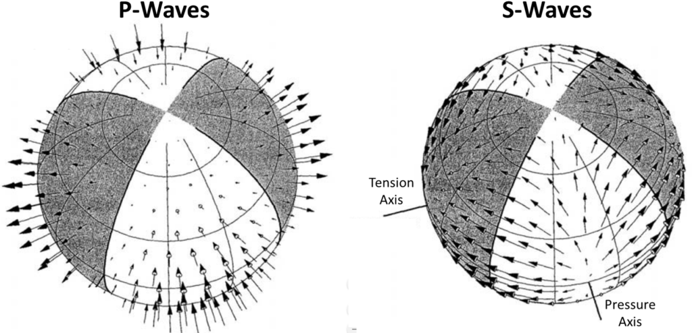
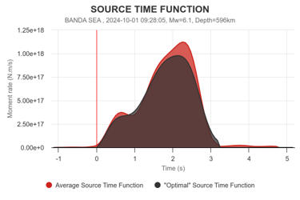



## Moment tensor matrix
We can understand the moment tensor matrix through comparing it with the stress tensor. The moment tensor actually describes the deformation at the source.

The moment tensor matrix is a $3\times 3$ matrix. It should always be symmetric because of Conservation of Angular Momentum. The trace of it represents the isotropic component, which describes the volumetric change. On the other hand, $M_{xy}$, $M_{yz}$, $M_{zx}$ describe the shear displacement. For natural earthquakes, people always observe earthquakes with pure shear displacement, which implies $M_{xx} = M_{yy} = M_{zz} = 0$. We use $M_0 = \mu A D$ to describe the seismiic moment, with $\mu$ the shear modulus, $A$ the sliding area and $D$ the slip distance. From my perspective, the connection between moment tensor matrix and seismic moment is that $\Vert M\Vert_2 = M_0$, namely $M_0 = \sqrt{M_{xy}^2 + M_{yz}^2 + M_{zx}^2}$. Each component of the **$M$** matrix has a unit of $N\cdot m$ similar to the moment itself and the three components work to imply the slip direction. 

## How it relates to beachball
More commonly used representation of focal mechanisms is the seismic beachballs. Initially, people obtain the beachball through the direction of P wave first arrivals observed in stations. If an earthquake happens, we treat its location as the origin and build spherical coordinates. The stations are located at an azimuth with respect to this event, and we can use $(\theta, \phi)$ to discribe the azimuth of stations. If we observe a positive P-wave first arrival, we plot a black dot there and a white dot vice versa. People found that the entire sphere is devided into four parts with two postive(black, representing tension) and two negative(white, representing compression). The two deviding planes are orthogonal to each other, If we project the southern hemisphere to a circle using the equalarea projection($r = cos(\theta), \phi = \phi$), we obtain the beachball. 

It is also feasible to build a bridge between the beachball representation and the moment tensor matrix. If we want to know whether a point on the beachball, quantified by $(\theta, \phi)$ is positive or negative, we can calculate it as $n^T M n$ with $n = (sin\theta cos\phi, sin\theta sin \phi, cos\theta)^T$ and $M$ the moment tensor matrix. Therefore, I think the beach ball can probably be better represented with not only positive or negative, but also the exact value. 

## Source time function
Whichever the moment tensor matrix or the beachball representation looks at the total released moment and slip amout. If we want a more precise description, we should look at how the moment releases with respect to time, namely the moment rate function. The following figure shows an example of the moment rate function. 

## How to simulate the displacement function observed in one station?

A traditional way to calculate the displacement function at one station is using Green's function. The wave propagation function is written as
$$
\rho(\mathbf{x}) \frac{\partial^2 u_i}{\partial t^2} = \partial_j \left[ \lambda(\mathbf{x}) \delta_{ij} \partial_k u_k + \mu(\mathbf{x}) (\partial_j u_i + \partial_i u_j) \right] + f_i
$$

Green's function looks at the displacement at point $x$ that results from the unit force function applied at point $x_0$, which can be written as
$$
u_i(\textbf{x}, t) = G_{ij}(\textbf{x}, t;\textbf{x}_0, t_0)f_j(\textbf{x}_0, t_0)
$$

Since the earthquake source is described by a douple couple force. The displacement induced by an earthquake at the station should have the following equation. 
$$
\begin{aligned}
u_i(\mathbf{x}, t) &= G_{ij}(\mathbf{x}, t; \mathbf{x}_0, t_0) f_j(\mathbf{x}_0, t_0) - G_{ij}(\mathbf{x}, t; \mathbf{x}_0 - \hat{\mathbf{x}}_k d, t_0) f_j(\mathbf{x}_0, t_0) \\
&= \frac{\partial G_{ij}(\mathbf{x}, t; \mathbf{x}_0, t_0)}{\partial (x_0)_k} f_j(\mathbf{x}_0, t_0) d
\end{aligned}
$$

The force vectors $f_j$ are separated by a distance $d$ in the $$\hat{\mathbf{x}}_k$$ direction. The product $f_j d$ is the $k$th column of $M_{jk}$ and thus

$$
u_i(\mathbf{x}, t) = \frac{\partial G_{ij}(\mathbf{x}, t; \mathbf{x}_0, t_0)}{\partial (x_0)_k} M_{jk}(\mathbf{x}_0, t_0)
$$

Green's function is elegant in the theory. However, since a perfect delta function never exists, solving the delta function and then applying a convolution unavoidably introduce bias. Therefore, people choose to solve the wave equation directly because this is computationally equivalent to solving Green's function. 

[1] https://mxrap.com/theory/moment-tensor-guide/